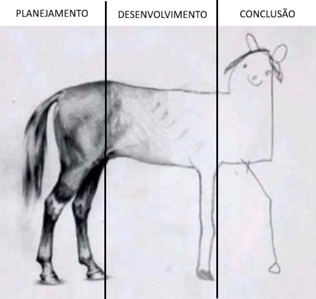

# Introduction

The scientific research follows the model shown in the figured cross-referenced here (@fig-pesquisa).

The objective of this study is to present a list of species of zooplankton (Rotifera, Cladocera and Copepoda) from the Jaguaribe River (Ceará), in semi-arid Brazil. We provide additional comments on main taxa distribution along the river.

# Material and Methods

Data and methods are discussed in @sec-data-col. This citation will appear in the bibliography section (@gouveia2017; @medeiros2008).

## Study Area and Sampling Design

See publications by @gouveia2017.

The present study was performed in the Jaguaribe River. It is the largest and most important river in the state of Ceará, with a length of 633 km, draining an area of ​​72,560 km², which is equivalent to about 48% of the state's territory (CSBH - <http://www.csbhmj.com.br/conheca/>). Due to the predominance of crystalline rocks in the region's soils, the availability of aquifers is limited, with the exception of the Chapada do Araripe, where there is greater potential for underground storage [@costa2016]. The basin is composed of the Upper, Middle, and Lower Jaguaribe sub-basins, in addition to the Banabuiú and Salgado river sub-basins. Its headwaters are located in the Serra da Joaninha, in the municipality of Tauá, and its mouth is in the Atlantic Ocean, near the municipality of Fortim (Dantas et al. 2011). Study sites were distributed along the Jaguaribe River: Jati (7° 41′ 13″ S, 39° 00′ 22″ O), Aurora (6° 56′ 33″ S, 38° 58′ 03″ O), Icó (6° 24′ 23″ S, 38° 51′ 46″ O), Cruzeirinho (Icó) (06°16′16″ S, 38°44′37″), Jaguaribe (5° 53′ 15″ S, 38° 37′ 19″ O), São João do Jaguaribe (5° 16′ 16″ S, 38° 16′ 25″ O), Quixeré (5° 04′ 27″ S, 37° 59′ 19″ O), Russas (4° 56′ 23″ S, 37° 58′ 25″ O) e Jaguaruana (4° 50′ 14″ S, 37° 46′ 55″ O). The basin's climate, according to the Köppen classification, is type BS, semi-arid or steppe climate, with an annual evaporation potential of approximately 2200mm while the average annual precipitation is between 500 and 900mm/year (Gaiser et al., 2003).

## Data Collection {#sec-data-col}

See publications by @macêdo2019.

Nine study sites were established and sampled three times along the main course of Jaguaribe River, distributed among the Upper, Middle, and Lower Jaguaribe sections, during the wet (March 2020 and May 2022) and dry (November 2019 and 2021) seasons. Zooplankton was collected using a plankton net (opening diameter 30 cm, 70 cm long and mesh size 60 μm). The net was towed at three different locations (henceforth termed sample) in each of the three study sites for a distance of 10 m on the surface of the water at dusk. To minimize variation in sampling efficiency across samples, velocity and length of tows were similar and the net was washed between each tow to prevent clogging. Environmental variables were measured during each sampling campaign. Temperature, pH, oxidation-reduction potential, electrical conductivity, total dissolved solids, dissolved oxygen, and salinity were measured in situ using a Hanna multiparameter water quality meter. Water samples were also collected for laboratory determination of ammonia, total phosphorus, nitrate, and nitrite. The zooplankton collected was anesthetized with commercial sparkling water and preserved in 4% formalin. Sucrose was added to the preserved sample to prevent cladocerans from losing eggs and to minimize carapace distortion (Medeiros et al. 2011). In the laboratory, all individuals were identified and counted in a Sedgewick-Rafter counting cell (Koste 1978; Elmoor-Loureiro 1997, among others). Only rotifers, cladocerans and copepods were considered in the present study.

## Statistical Analyses

Here you can add your statistical analyses and follow the text with the RStudio code. Following the model in <https://elviomedeiros.github.io/Bentos2006_Q/>.

```{r, CHUNK-TITLE}
#| eval: false
#| message: false
#| warning: false
#| results: false
#| echo: true
#| purl: false
#| code-fold: true
#| code-overflow: wrap
#| code-summary: "Code: Summary"

plot(1:10)
```

# Results

The results section should follow the model in <https://elviomedeiros.github.io/Bentos2006_Q/>.

## Environmental variables

## Community structure

# Discussion

# Conclusions {.unnumbered}

# Acknowledgements {.unnumbered}

# Authorship contribution statement {.unnumbered}

Authorship of this paper is based on @credit2026.

Author1: Writing – review & editing, Writing – original draft, Formal analysis, Data curation, Conceptualization.\
Author2: Writing – review & editing, Data curation, Conceptualization.\
Author3: Writing – review & editing, Formal analysis, Data curation, Conceptualization.

# Ethical approval {.unnumbered}

This study did not require ethical approval as it did not involve human participants or sensitive data. Field surveys were conducted based on collection permit number (IEF-10327-6 and SISBIO-10.635-7).

# References {.unnumbered}

::: {#refs}
:::

\pagebreak
\newpage

# Figures and Tables {.unnumbered}

## Figures {.unnumbered}

{#fig-pesquisa}

## Tables {.unnumbered}

\pagebreak
\newpage

# Apendices {.unnumbered}

# Non-used figures and tables {.unnumbered}

::: callout-warning
# Non-used codes

```{r}
#| label: non-used code
#| eval: false
#| warning: false
#| message: false
#| results: false
#| code-fold: true
#| code-overflow: wrap
#| code-summary: "non-used code" 

table(1:10)
```
:::
